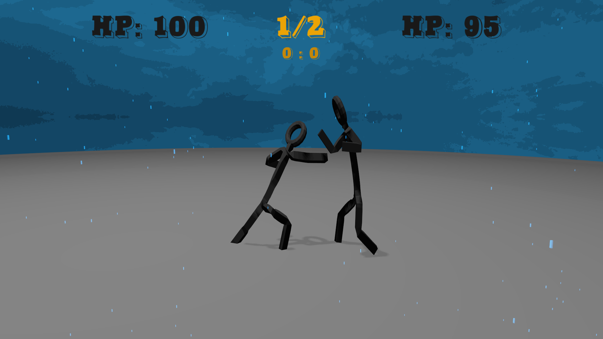
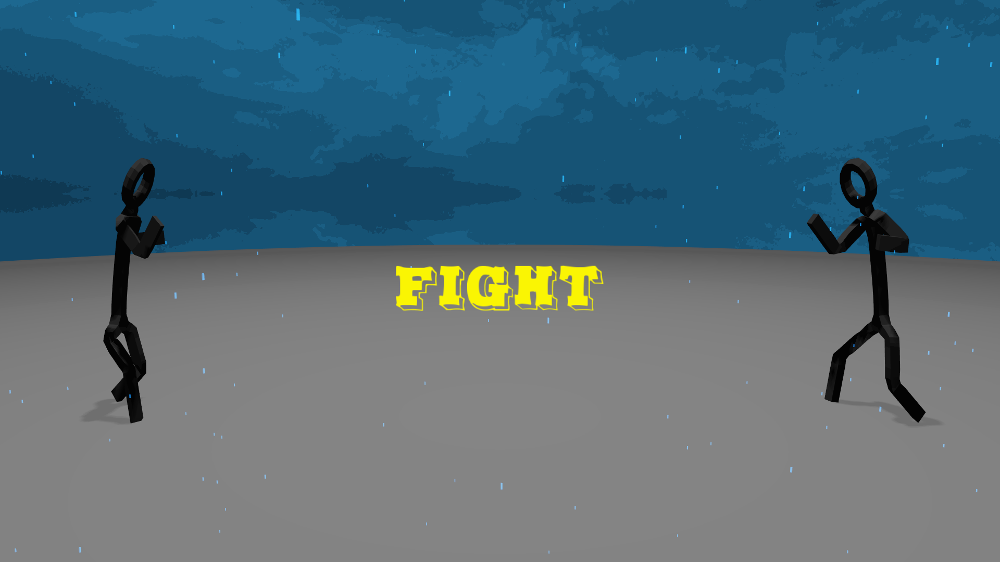
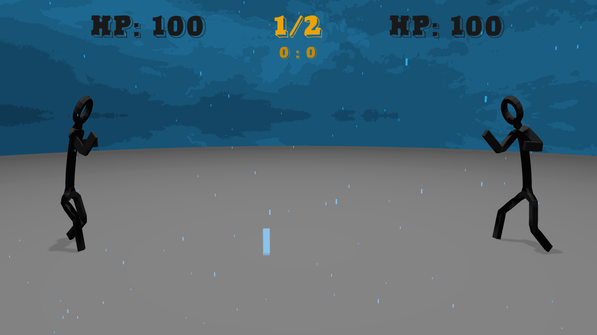
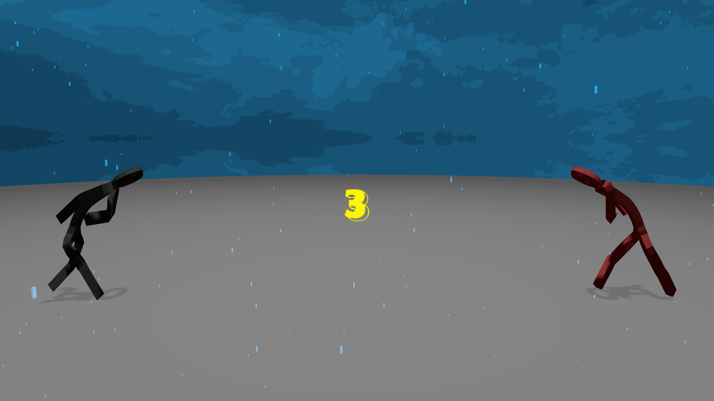
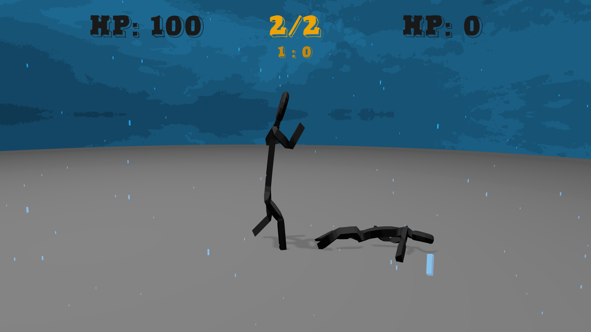
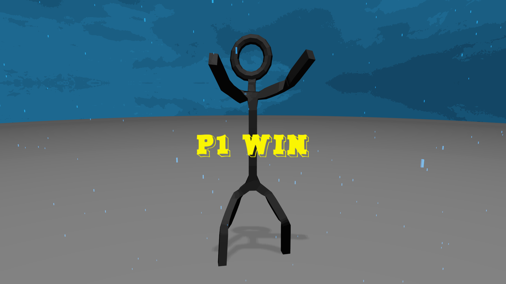
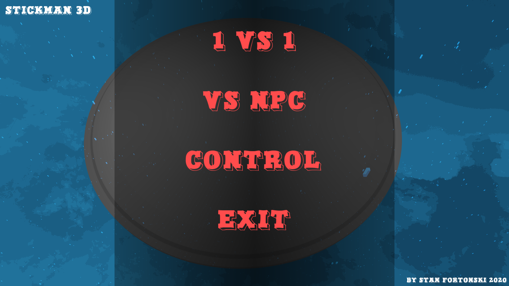

# Stickman 3D: First Round
### Game written in C++ on API OpenGL 4.1

YouTube video: https://www.youtube.com/watch?v=XC_Xxf7IHnU

### What game is this?
This game is inspired on old games with handwritten stickmans and Tekken. This is only fast implementation of the game but not demo. Game allows to play with friend or with AI.

**This application is based on [my own 3D Engine](https://github.com/stanfortonski/3D-Engine-OpenGL-4).**

### Additional Features:
- cell shading
- blocky rain

### Requirements:
- Graphics card that support OpenGL 4.1
- Graphics card drivers
- It is good to have joystick but not necessary

Tested on RX 480 and GTX 650 ti.

### Screenshots:

### Credits
- Custom font: https://www.1001fonts.com/duo-font.html
- Models made by me with Blender 2.8: https://www.blender.org
